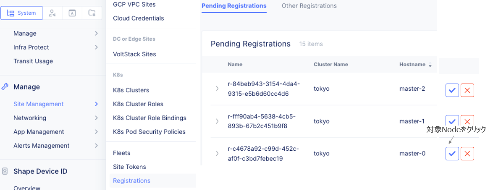

CE - VMware
================================================
以下の作業を実行します。

1.トークン発行
2.イメージダウンロード
3.Site起動
4.レジストレーション
5.ステータス確認

1.トークン発行
-------
ConsoleのHomeから"Cloud and Edge Sites"を選択し、
メニュー中の"Manage"からSite Management > site tokenと選択し、トークンを発行します。(全CEで同じTokenが使えます)

.. image:: ../content1/img/img-1.png

2.イメージダウンロード
-------
siteのイメージを以下よりダウンロードします。
https://www.volterra.io/docs/images

.. image:: ../content1/img/img-2.png

3.Site起動
-------
各種設定を行います。(起動後に設定することも可能です。)

※パラメータを設定し忘れた場合、ESXiのコンソールからSiteにログイン。
(ネットワークは設定済みで、トークンを設定していない場合はSSHでアクセス)

.. image:: ../content1/img/img-4.png

.. image:: ../content1/img/img-5.png

4.レジストレーション
-------
初期設定したSiteはインターネット経由で自動でves.volterra.ioへアクセスし、Consoleに表示されます。
Home　> Cloud and Edge Sites > Manage > Site Management > Registrationsと選択し、操作します。

.. image:: ../content1/img/img-7.png

5.ステータス確認
-------
約20-30分後にステータス確認します。
Home > Cloud and Edge Sites > Sites > Site Listと選択します。

.. toctree::
   :titlesonly:
   :caption: コンテンツ
   :glob:

   

