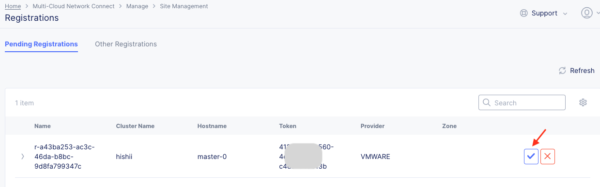

CE - VMware
================================================
※本資料の画面表示や名称は資料作成時点の画面表示を利用しております。アップデート等より表示が若干異なる場合がございます。

手順概要
-------
1.トークン発行

2.イメージダウンロード

3.Site起動

4.レジストレーション

5.ステータス確認

1.トークン発行
-------
ConsoleからHome　> Multi-Cloud Network Connect > Manage > Site Management > Site Tokensと選択し、Add Site Tokenよりトークンを発行します。(全CEで同じTokenが使えます)

任意の名前を入力し、Save and Exitを選択します。

2.イメージダウンロード
-------
イメージファイルを以下URLよりダウンロードします。

https://docs.cloud.f5.com/docs/images

VMwareのコンソールからインストールを実施します。

3.Site起動
-------
各種設定を行います。(起動後に設定することも可能です。)

.. image:: ../content1/img/img-3.png

※パラメータを設定し忘れた場合、ESXiのコンソールからSiteにログイン。
(ネットワークは設定済みで、トークンを設定していない場合はSSHでアクセス)

4.レジストレーション
-------
初期設定したSiteはインターネット経由で自動的にXCへアクセスし、Consoleに表示されます。

Home　> Multi-Cloud Network Connect > Manage > Site Management > Registrationと選択し、Siteの登録を行います。

対象のSiteのチェックを選択し、必要事項を記載します。

5.ステータス確認
-------
約20-30分後にステータス確認します。

Home > Multi-Cloud Network Connect > Overview > Sites内 DashboardのSitesから対象Siteを確認します。

以上で、CEの初期設定は終了です。

.. toctree::
   :titlesonly:
   :caption: コンテンツ
   :glob:

