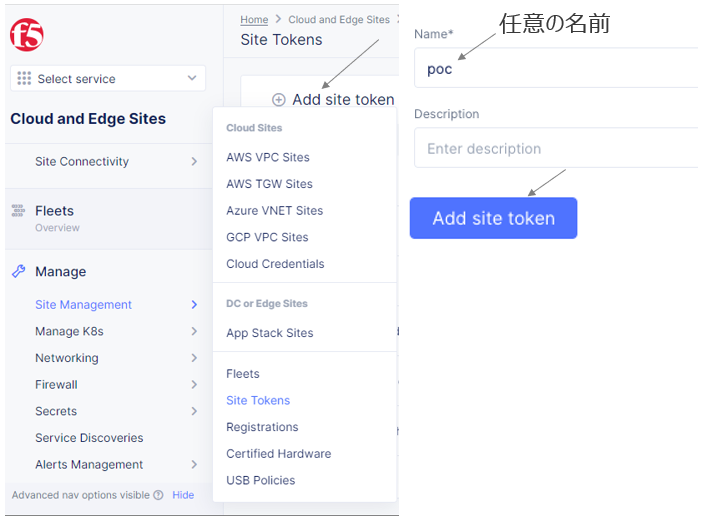
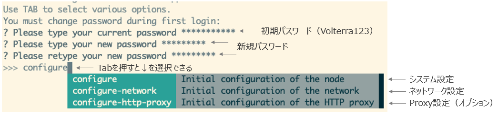
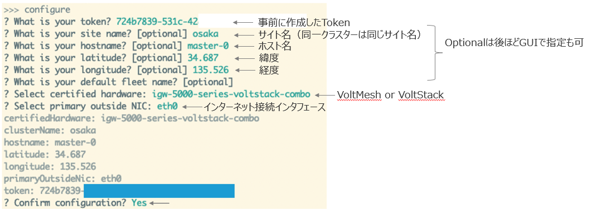
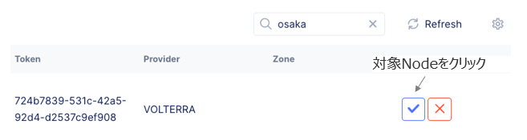
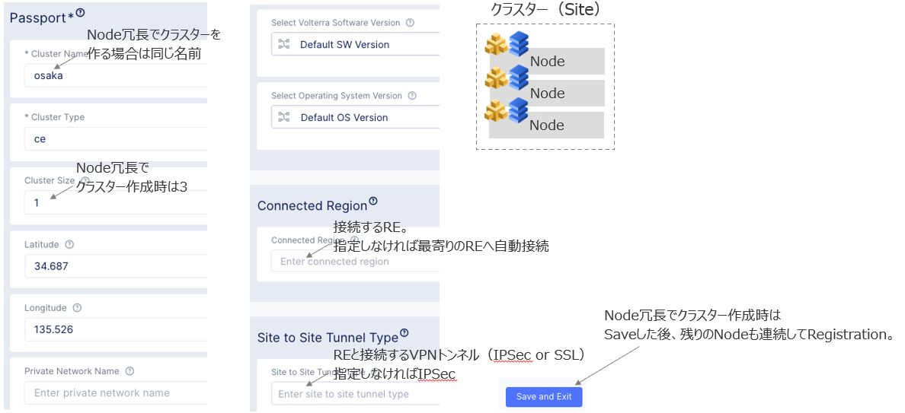
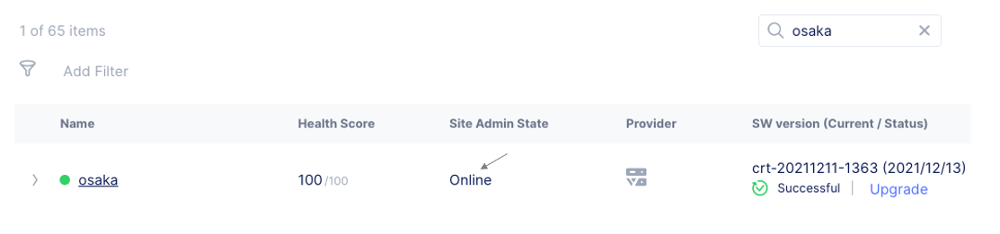

CE – Volterra HW
================================================
以下の作業を実行します。

1.トークン発行

2.初期アクセス

3.レジストレーション

4.ステータス確認

1.トークン発行
-------
ConsoleからHome　> Cloud and Edge Sites > Manage > Site Management > Cloud Credentialsと選択し、
トークンを発行します。(全CEで同じTokenが使えます)

2.初期アクセス
-------
HWへSSHアクセスします。（admin/Volterra123）
DHCPによりインターネットへアクセスでき、DNSによる名前解決ができる場合は“Configure”を選択します。
※できない場合は“configure-network”でインターネットアクセスするためのパラメータを手動設定します。

今回は、DHCPによりインターネットへアクセスでき、DNSによる名前解決が可能な環境での設定手順をご案内します。

3.レジストレーション
-------
初期設定したSiteはインターネット経由で自動でves.volterra.ioへアクセスし、Consoleに表示されます。
Home　> Cloud and Edge Sites > Manage > Site Management > Registrationsと選択し、操作します。

4.ステータス確認
-------
約20-30分後にステータス確認します。
Home > Cloud and Edge Sites > Sites > Site Listと選択します。

.. toctree::
   :titlesonly:
   :caption: コンテンツ
   :glob: