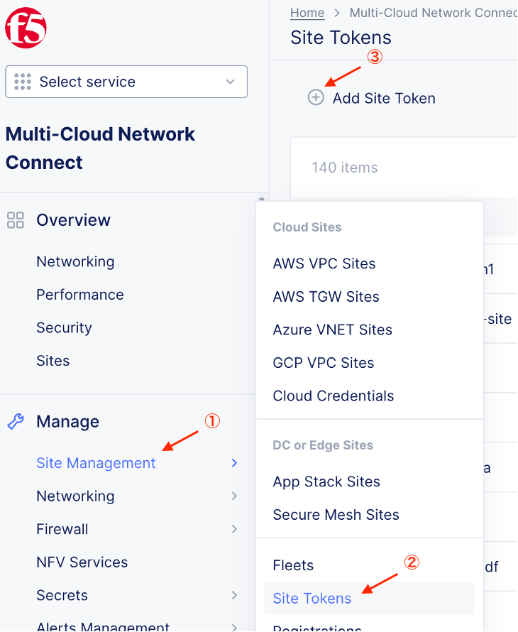
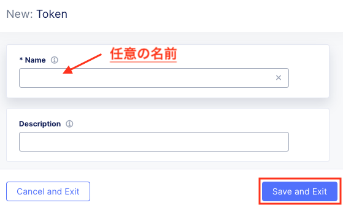

CE – Volterra HW
================================================
※本資料の画面表示や名称は資料作成時点の画面表示を利用しております。アップデート等より表示が若干異なる場合がございます。

手順概要
-------
1.トークン発行

2.初期アクセス

3.レジストレーション

4.ステータス確認

1.トークン発行
-------
ConsoleからHome　> Multi-Cloud Network Connect > Manage > Site Management > Site Tokensと選択し、Add Site Tokenよりトークンを発行します。(全CEで同じTokenが使えます)

任意の名前を入力し、Save and Exitを選択します。

2.初期アクセス
-------
HWへSSHでアクセスします。(初期ログインID/パスワード:  admin/Volterra123)

DHCPによりインターネットへアクセスでき、DNSによる名前解決ができる場合は“Configure”を選択します。

※できない場合は“configure-network”でインターネットアクセスするためのパラメータを手動設定します。
今回は、DHCPによりインターネットへアクセスでき、DNSによる名前解決が可能な環境での設定手順をご案内します。

.. image:: ../content2/img/img-2.png

.. image:: ../content2/img/img-3.png

3.レジストレーション
-------
初期設定したSiteはインターネット経由で自動的にXC(ves.volterra.io)へアクセスし、Consoleに表示されます。

Home　> Multi-Cloud Network Connect > Manage > Site Management > Registrationと選択し、Siteの登録を行います。

.. image:: ../content2/img/img-4.png

.. image:: ../content2/img/img-5.png

4.ステータス確認
-------
約20-30分後にステータス確認します。

Home > Multi-Cloud Network Connect > Overview > Sites内 DashboardのSitesから対象Siteを確認します。

.. image:: ../content2/img/img-6.png

以上で、CEの初期設定は終了です。

.. toctree::
   :titlesonly:
   :caption: コンテンツ
   :glob:
