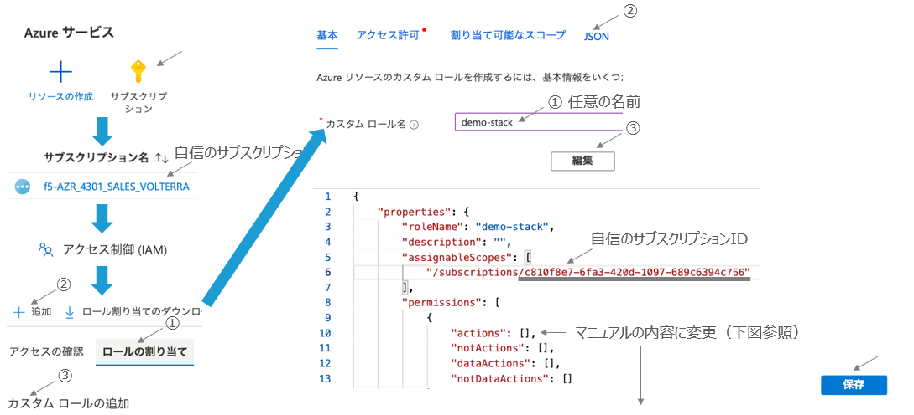
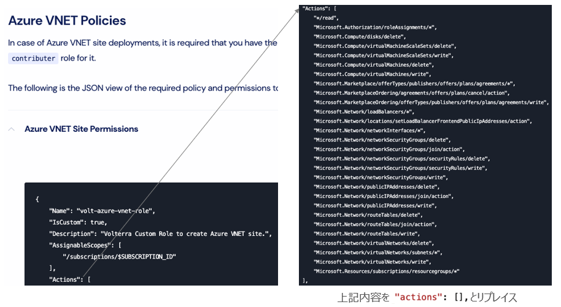
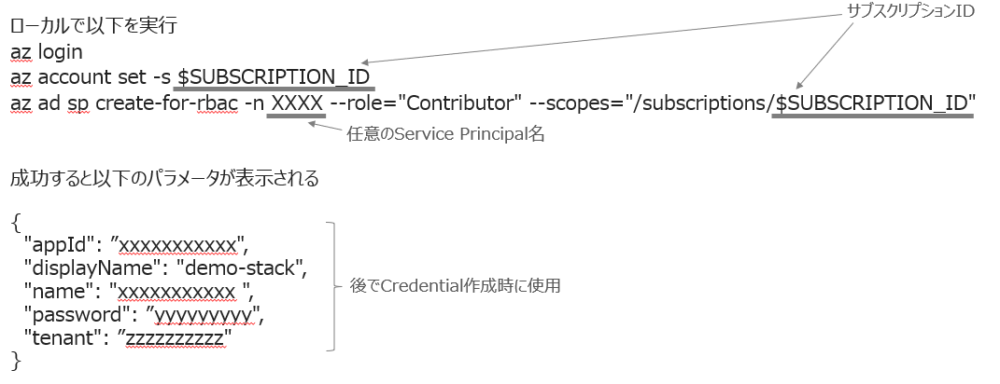
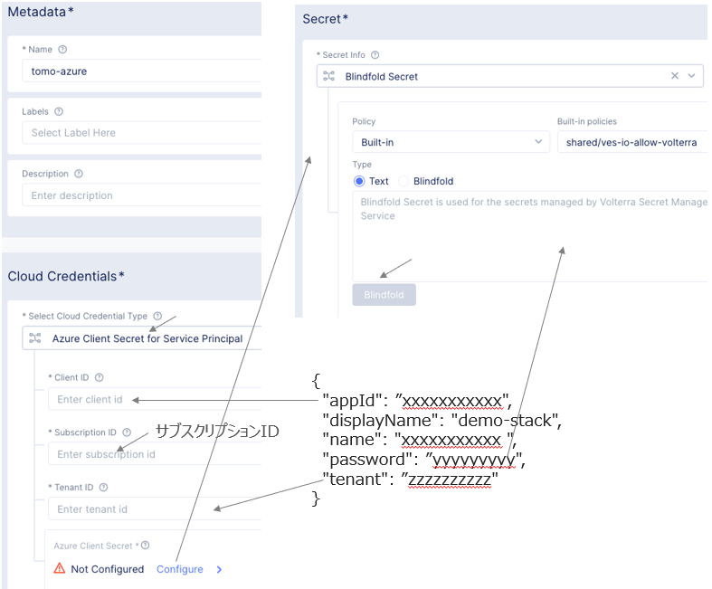
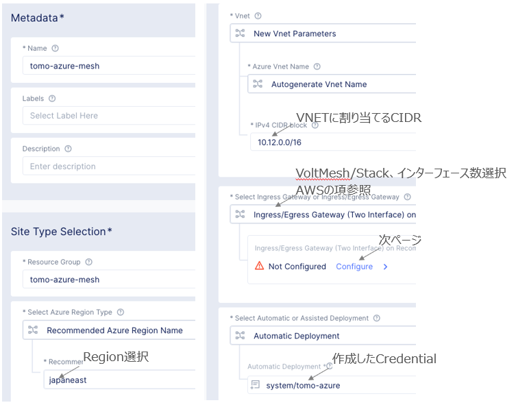
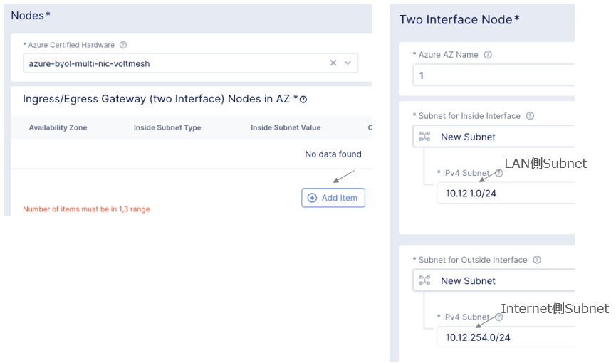
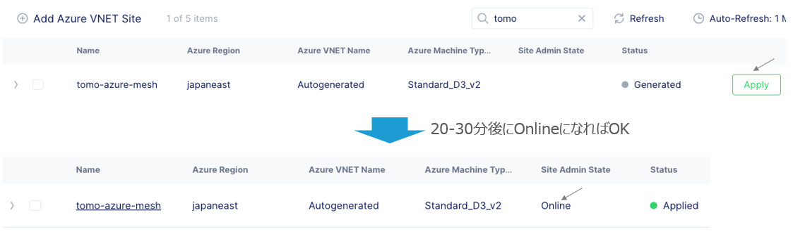

Site - Azure 
================================================
※本資料の画面表示や名称は資料作成時点の画面表示を利用しております。アップデート等より表示が若干異なる場合がございます。

手順概要
-------
1.Azureカスタムロール

2.Azure Service Principalアカウント

3.Credential作成

4.Azure Site作成

5.ステータス確認

1.Azureカスタムロール
-------
AzureのGUIコンソールからアカウントのカスタムロールを作成します。

※マニュアル　https://docs.cloud.f5.com/docs/reference/cloud-cred-ref/az-vnet-pol-reference

2.Azure Service Principalアカウント
-------
前項目のロールを使いServiec Principalアカウントを作成し、
ローカルにAzure CLIをインストールします。

https://docs.microsoft.com/en-us/cli/azure/install-azure-cli

3.Credential作成
-------
ConsoleからHome　> Cloud and Edge Sites > Manage > Site Management > Cloud Credentialsと選択し、
Credentialを作成します。

4.Azure Site作成
-------
ConsoleからHome　> Cloud and Edge Sites > Manage > Site Management > Azure VNET Sitesと選択し、操作します。

5.ステータス確認
-------
約20-30分後にステータス確認します。

Home > Cloud and Edge Sites > Sites > Site Listと選択します。

.. toctree::
   :titlesonly:
   :caption: コンテンツ
   :glob: