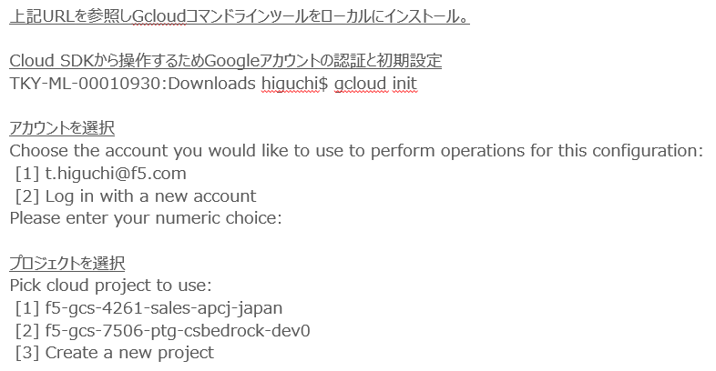
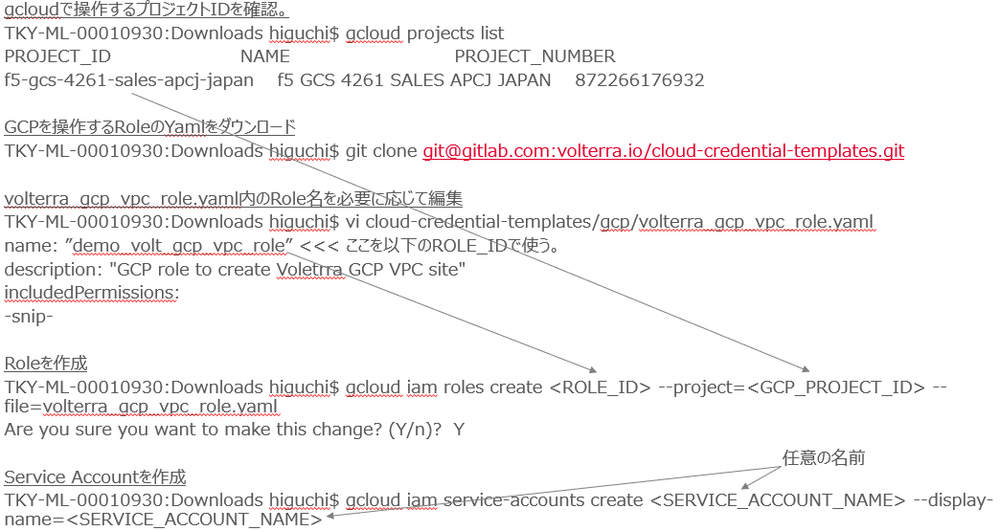
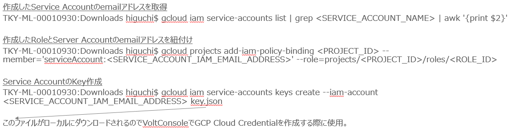
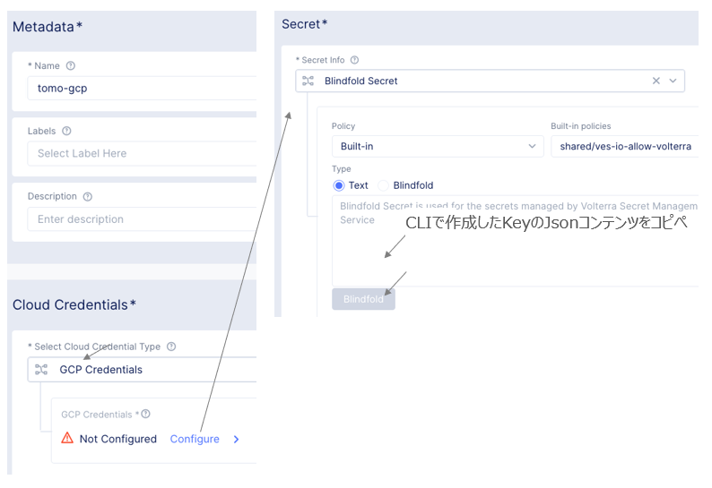
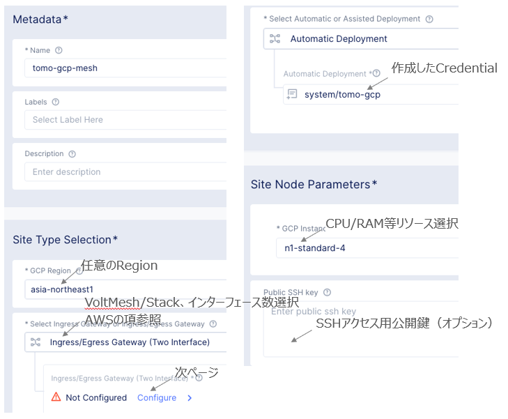
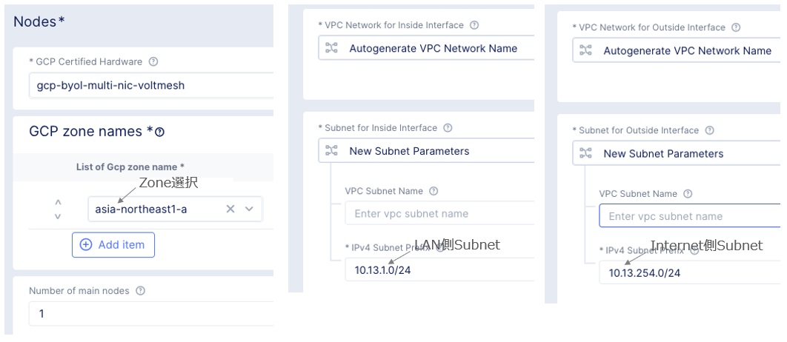

Site - GCP
================================================
※本資料の画面表示や名称は資料作成時点の画面表示を利用しております。アップデート等より表示が若干異なる場合がございます。

手順概要
-------
1.gcloudコマンドラインツール
2.GCP Role、Service Account作成
3.GCP Key作成
4.GCP Cloud Credential
5.GCP Site作成
6.ステータス確認

1.gcloudコマンドラインツール
-------
Gcloudコマンドラインツールインストールマニュアル(https://cloud.google.com/sdk/docs/install)

※詳細は以下マニュアル参照

+https://docs.cloud.f5.com/docs/reference/cloud-cred-ref/gcp-vpc-pol-reference

2.GCP Role、Service Account作成
-------

3.GCP Key作成
-------

4.GCP Cloud Credential
-------
ConsoleからHome　> Cloud and Edge Sites > Manage > Site Management > Cloud Credentialsと選択し、
Credentialを作成します。

5.GCP Site作成
-------
ConsoleからHome　> Cloud and Edge Sites > Manage > Site Management > GCP VPC Sitesと選択し、操作します。

6.ステータス確認
-------
約20-30分後にステータス確認します。

Home > Cloud and Edge Sites > Sites > Site Listと選択します。
"Site Admin State"がOnlineとなっていれば完了です。

.. toctree::
   :titlesonly:
   :caption: コンテンツ
   :glob: